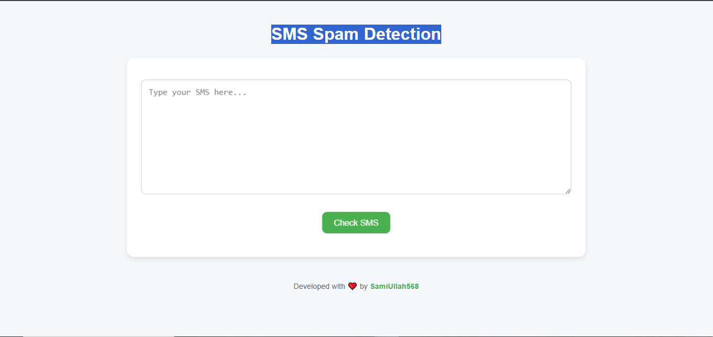

# SMS Spam Detection Project

Welcome to the SMS Spam Detection Project! This project aims to build a machine learning model to classify SMS messages as spam or not spam.

## Table of Contents
- [Introduction](#introduction)
- [Installation](#installation)
- [Usage](#usage)
- [Screenshot](#screenshot)
- [Results](#results)
- [Contributing](#contributing)
- [License](#license)

## Introduction
In this project, we use natural language processing (NLP) techniques to analyze and classify SMS messages. The goal is to create a model that can accurately identify spam messages.

## Installation
To get started with the project, follow these steps:

1. Clone the repository:
    ```bash
    git clone https://github.com/SamiUllah568/sms_spam_detection.git
    ```
2. Navigate to the project directory:
    ```bash
    cd sms_spam_detection
    ```
3. Install the required dependencies:
    ```bash
    pip install -r requirements.txt
    ```

## Usage
To use the SMS Spam Detection model, run the following command:
```bash
python main.py
```

## Screenshot
Here is a screenshot of the website interface:



## Results
**Accuracy is Already Good So We do not need to do Hyper Parameter Tuning**

* Best Model is -- >> **Log_reg** with **BOW**
  * With high **Accuracy and Precision**

| Models                  | Accuracy_score_bow | Precision_score_bow | Accuracy_score_tfidf | Precision_score_tfidf |
|-------------------------|--------------------|---------------------|----------------------|-----------------------|
| logistic_regression     | 0.982592           | 0.992248            | 0.970019             | 0.975000              |
| MultinomialNB           | 0.988395           | 1.000000            | 0.968085             | 1.000000              |
| RandomForestClassifier  | 0.978723           | 0.992000            | 0.974855             | 0.991736              |
| XGBClassifier           | 0.982592           | 0.977444            | 0.976789             | 0.984000              |

## Contributing
Contributions are welcome! Please read the [contributing guidelines](CONTRIBUTING.md) first.

## License
This project is licensed under the MIT License. See the [LICENSE](LICENSE) file for details.